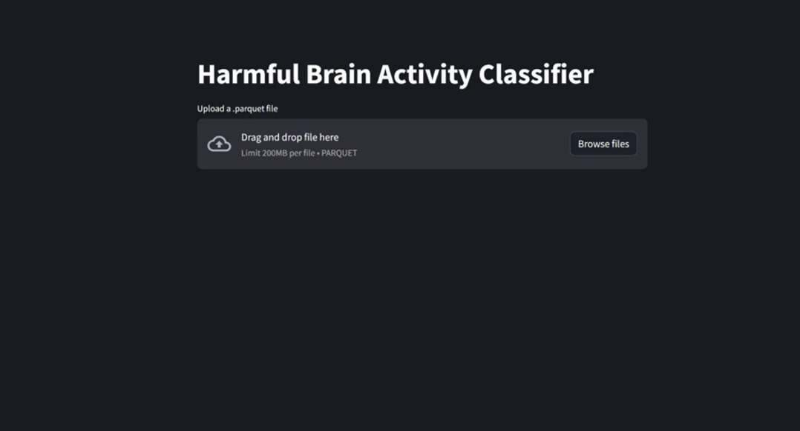
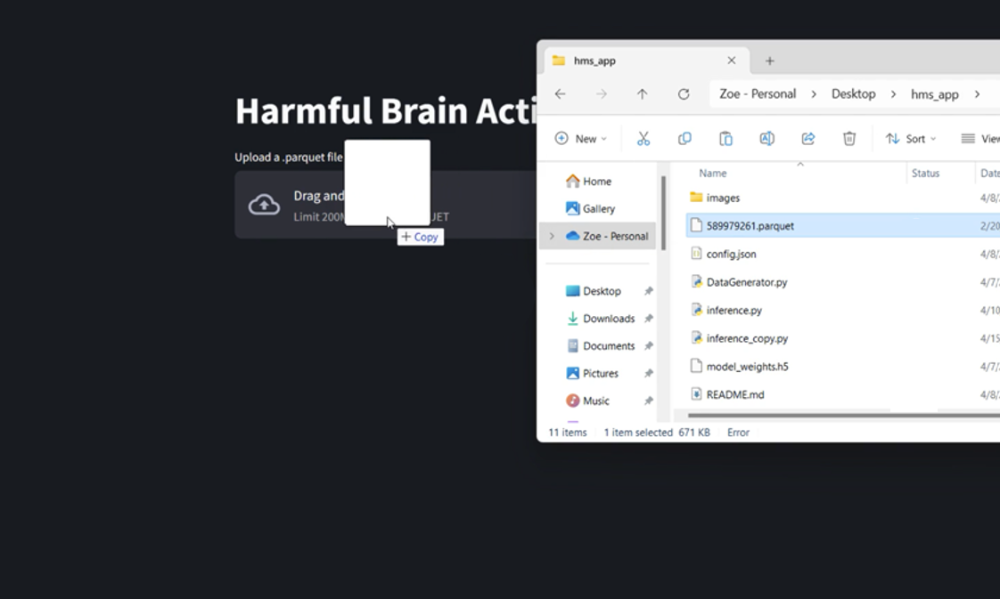
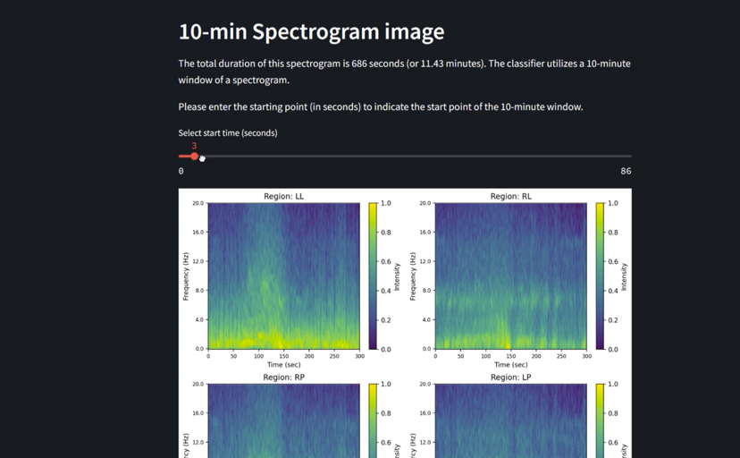
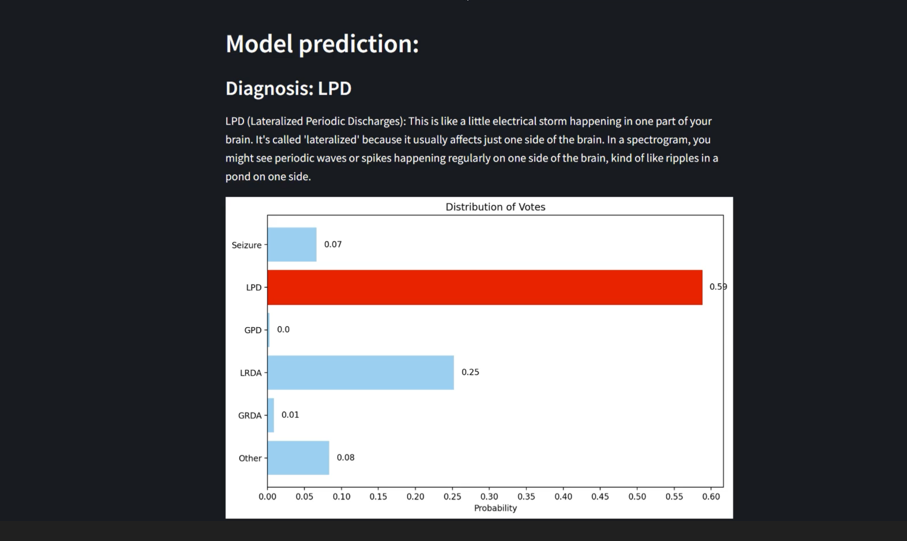
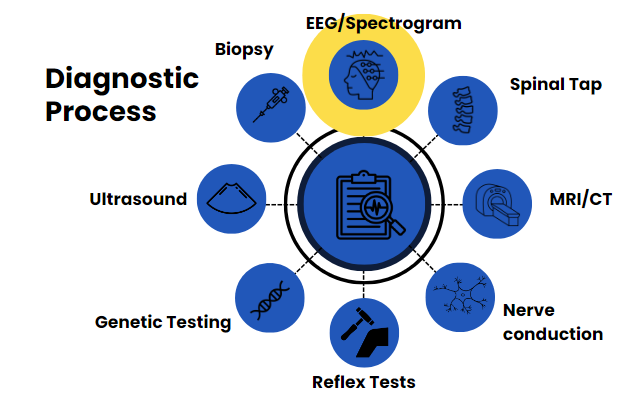
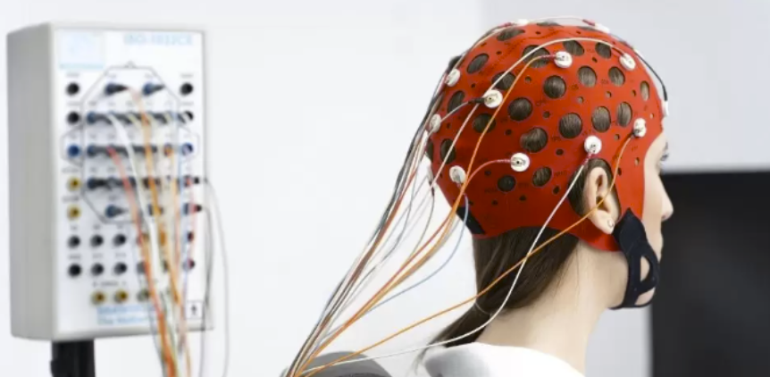
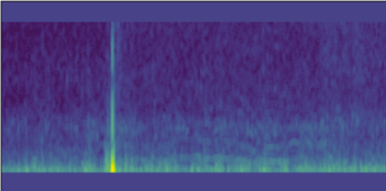
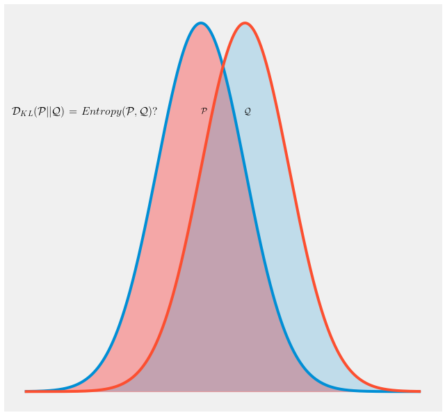
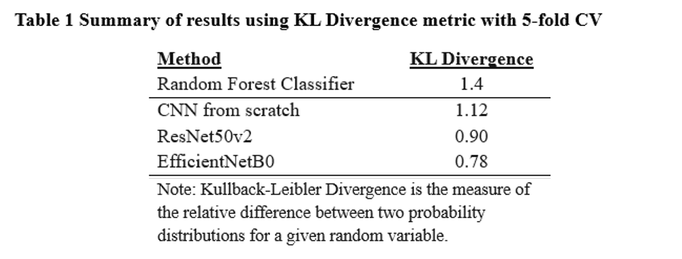

# Harmful Brain Activity Classification
### Project Overview
This project is part of the [Kaggle competition](https://www.kaggle.com/competitions/hms-harmful-brain-activity-classification/overview) "HMS Harmful Brain Activity Classification." The goal of this competition
is to develop machine learning models that can identify harmful brain activity patterns from EEG data.
This challenge aims to push forward the field of neuroinformatics and contribute to health informatics by automating the
detection of harmful brain activity, potentially improving patient outcomes in clinical settings.

### Competition Data
The dataset provided by the competition consists of EEG and spectrogram recordings from multiple subjects. 
For each recording, a team of expert neurologists cast votes for one of six possible diagnoses -- Seizure, LPD, GPD, 
LRDA, GRDA, or Other -- based on the presence of specific brain activity patterns present in the spectrograms.
Participants are expected to use this data to train models capable of predicting the normalized vote distribution
for each recording.

### Dependencies

- Python 3.11
- Other dependencies can be found in the __requirements.txt__ file

### Usage

1. Clone the repository or download the following scripts:

- `inference.py`
- `DataGenerator.py`
- `config.json`
- `model_weights.h5`
- `589979261.parquet` (for testing the application)

2. Follow requirements.txt installations
(or pip install -r requirements.txt from CLI)

4. Run the script in your cmd:

```bashrc
streamlit run inference.py
```

This will start a local web server and open the application in your default web browser, where you can upload data for inference (example: 589979261.parquet). 

## Overview of application

After the application is running, the user will see the default page:
<p align="center">
  
</p>

The user must drag and upload a .csv or .parquet file containing the spectrogram measurements.
<p align="center">
  
</p>

A spectrogram recording can vary in length. In order to classify an image in the CNN, the input must have consistent dimensions. Therefore, an image represents 10 minutes of the spectrogram. If the spectrogram is longer than 10 minutes, the user can select the start of the image with the sliding bar. Each spectrogram image produced is made of 4 sub-images representing brain activity in 4 different regions of the brain. The model concentatenates these subimages into one image for classification. 
<p align="center">
  
</p>

The results are shown not as one diagnoses, but as a distribution of probabilities. In this case the image was classified as an LPD with a probability of 59%
<p align="center">
  
</p>


# Motivation of project

## Background
Diagnosing neurological disorders (ND) is challenging, with patients typically waiting an average of two years to receive a diagnosis. Meanwhile, there are over 3 billion people worldwide suffering from neurological disorders. The diagnostic process can be long and tedious, containing many different types of neurological tests. 

<p align="center">
  
</p>
<p align="center">
  <em>Different diagnostic tools for diagnosing ND</em>
</p>

One of the first and most common tests that patients undergo is an EEG. An EEG, or electroencephalogram, is a test that measures electrical activity in the brain using electrodes attached to the scalp. This raw EEG data can be converted to an image, called a **spectrogram**, which allows for doctors to see anomalies in brain activity and classify them based on their shape and intensity. Correctly classifying the spectrogram image is crucial, as this is one of the first diagnostic tools that can point the doctor in the right (or wrong) direction, which can either shorten or prolong the patients journey to the correct diagnosis.

<p align="center">
  
  <span style="font-size: 2em; vertical-align: middle; display: inline-block; margin-top: -150px;">➡️</span>
  
</p>
<p align="center">
  <em>A typical EEG test and the spectrogram image produced</em>
</p>

## Current Problems in EEG Analysis
- **Labor/Resource intensive**: Spectrogram image classification requires multiple highly specialized and trained neurologists in order to make a single classification. 
- **Uncertainty**: The image does not typically point to a specific class, but rather 2 to 3 plausible classes. 

Our goal was to assist specialists in interpreting spectrograms, in order to reduce the time and resources needed to diagnose a patient.

## Our Metric - KL Divergence

Since this is one of the first and most important stages of the diagnostic process, our goal is not to replace the specialists, but rather to provide an outside resource and perspective that can either confirm or challenge their choice. 

The target values of our data were a distribution of votes for each class, rather than one class. As mentioned previously, an image can point to 2 or 3 possible classes, and it was almost always the case (~98% of the data) that there was NOT a unanimous vote for a particular class. Other tests later in the diagnostic process may give more insight, as diagnosing an ND takes into account the results of many different tests. In order to simulate the process of a group of specialists voting, we decided to predict the _probability_ of each class, rather than predict the class itself. Therefore, using metrics like accuracy and precision/recall were not appropriate. 

Instead, we used KL Divergence to determine how close our model predicted the _distribution of the votes_ to the target values.

<p align="center">
  
</p>
<p align="center">
  <em>Visual of KL Divergence metric</em>
</p>

## Results

Our baseline model was a Random Forest Classifier. We also created a CNN from scratch, which showed minor improvement. However, the results improved drastically with the use of existing, more complex CNN architectures like ResNet50V2 and EfficientNetB0. We did not do finetuning, but just used the architecture. 

<p align="center">
  
</p>

### Acknowledgements
Thank you to Kaggle and HMS for hosting the competition and providing the dataset, and to the ITC staff for guidance and mentorship during this project.

### Authors
Or Gewelber ([LinkedIn](https://www.linkedin.com/in/or-gewelber/)) ([Github](https://github.com/LightAcronym))

Zoe Stankowski ([LinkedIn](https://www.linkedin.com/in/zoe-stankowska/)) ([Github](https://github.com/zstankow))

Sacha Koskas ([LinkedIn](https://www.linkedin.com/in/sacha-koskas-a3a46b1b5/)) ([Github](https://github.com/SachaKsk))
